# #100DaysOfCode Log - Round 1 - [unm4sk]

The log of my #100DaysOfCode challenge. Started on [January 25, Tuesday, 2022].

## Log

### R1D1 
Learned a lot new about decorators. Still pretty confusing, but I am getting better at understanding how this concept works. 

Time track: 

### R1D2
Finished learning decorators. Got a bit closer to fully understanding a concept!😎 The power of this function is incredible! Did an excercise to implement what I've learned so far about decorators.
Finished Error Handling part of a course. Was pretty easy because I had implemented it before. However, some things I did *not* know, so it was pretty useful overall. [files to be uploaded]

Time track: 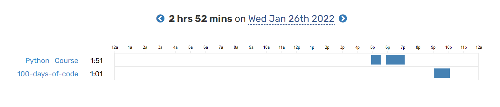

### R1D3
Didn't pay too much attention for course and decided to spend it implementing gained knowledge about pure functions. I bumped into some problems, esp. with dictionaries and getting values (was using API).
Nevertheless, built a working but not beauty and fully-fledged script. Planning to make it look beautiful and informative!
It is in early development, so I am not sharring a link to my project. If tomorrow won't be so hard day I will upload it on GitHub.
Overall, I am *more* than just satisfied!

Time track: 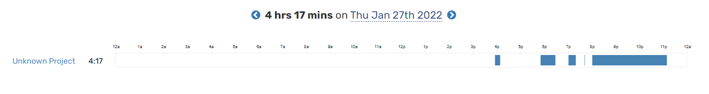

### R1D4
Oooh. With no doubt it was the most time I have coded in a day. My thoughts? Don't feel exhausted, not at all! Finished my [defme](https://github.com/unm4sk/defme) project. I have not only implemented libraries I wanted to, but also made my code more logical & clear. Also, I did an *Excel* version of my script. It is way better in terms of perfomance. 
I am very proud of myself, to be honest :) 
I think tomorrow I will focus on a course becaue of opportunities it can provide to me.

Time track: 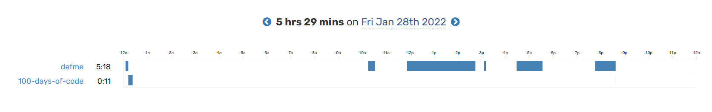

### R1D5
Getting used to coding this many hours, haha. No, seriously, feel like it's really possible.
Of course, there were moments today when I felt little unconcentrated and sleepy. So far, I finished the generators section and in the middle of *Modules in Python* section. 
Completed a cool game excercise using built-in sys module. Now it's very cool to execute a game in a *USER mode*, adding attributes when running a program!
Looking for tomorrow's journey! (Probably will code less time cuz of school h/w)

Also, completed 2 Python Exams. Got good scores, remembered some stuff. Feel very good about that! 

Time track: 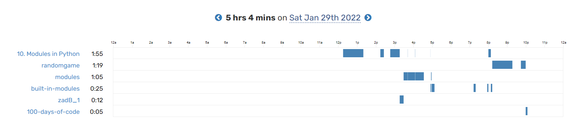
Exams results: 
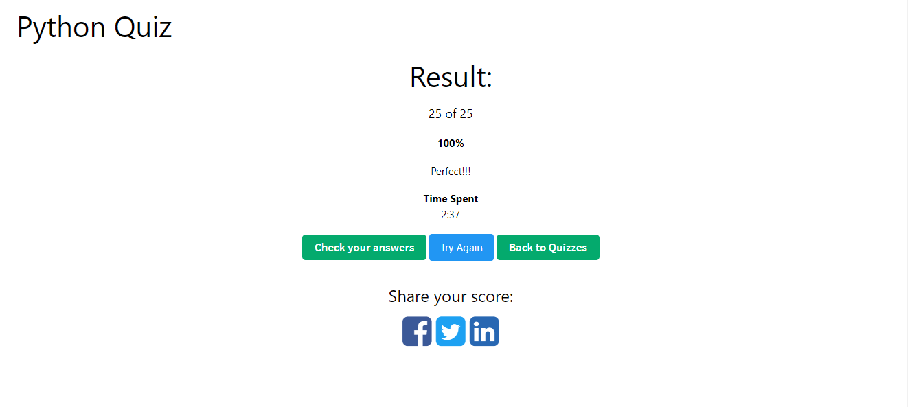
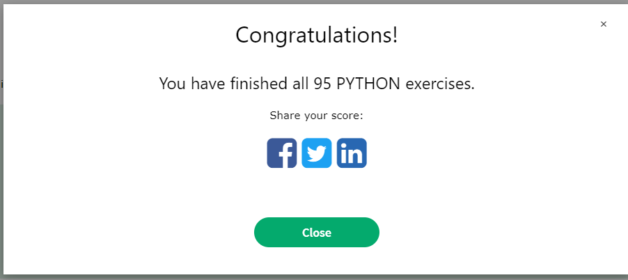

### R1D6
Even though the beggining of today wasn't that great (a great bunch of school assignments, got very exhaused), I spent some great time creating & refreshing my knowledge about OOP. It was hard for me to understand *why* I may want to use it in my projects, but I think I am getting the idea behind this concept.

I finished the Python modules and debugging section. I actually never really used debugging. Now I see its power.

Apart from learning the course, I built 2 projects, implementing OOP (one from youtube, the second one I did all by myself).
I'll try my best to implement a *database* to my project and will use *Rich* again to create beautiful desing for it.

Time track: 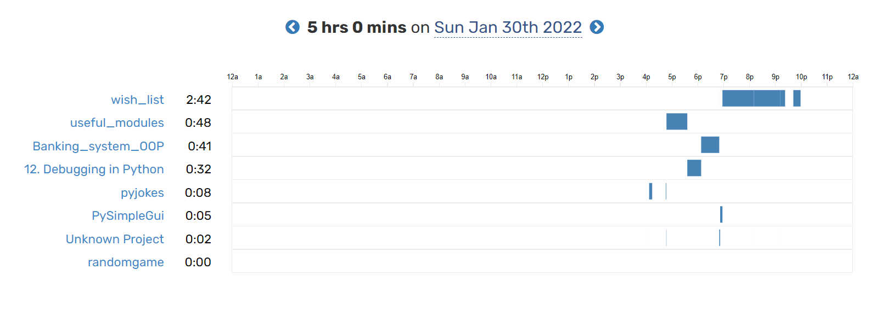

### R1D7
What day it was... I coded for **8 hours**! But even though time I spent coding was enormous (still attended school), I didn't feel exhausted, tired or unmotivated. In fact, I felt exactly opposite!

All my time I spent coding a project using OOP. I think I'll upload it on GitHub soon. 

Shortly, today I:
* almost finished my project
* learned how to use tinydb and rich for creating tables
* fixed lots and lots of bugs
* implemented new features (some of them I'll try to implement tomorrow)

Talking about tomorrow... 
TODO:
1. Finish My Project
2. Watch File IO
Although programming is really driving me crazy (in a good way -- I am super motivated rn and don't fear dificculties), I think I should start do my h/ws better and *start finally preparing for SAT!*

Time track: 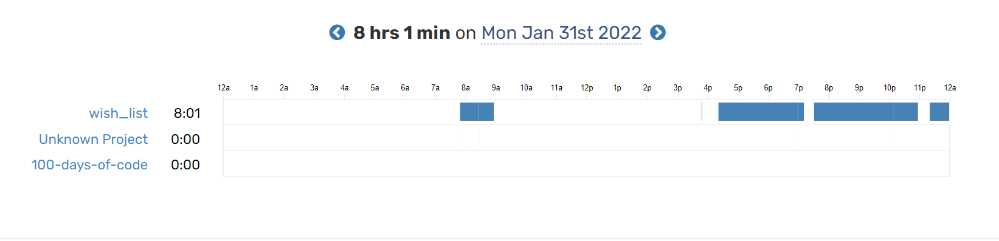

### R1D8
I wouldn't call today very exciting day simply because I was fixing, fixing, and fixing bugs. However, I am really happy I finished myproject! I added features, fixed sorting system, found many bugs and created lots of new ones by myself (fixed em too!). 

I only completed first item of my TODO list (see **R1D7**). Tomorrow I have my school in online, and I did my project, so, hopefully, I'll be able to learn some python from the course. I can't wait for some very cool projects that are on this course. 

Also, I'd like to start working on flutter but I think I need to finish python first. *Definetely!*

To sum up:
1. I didn't feel *that* excited throughout the day. However ***I finished my project!!!***
2. Was coding for a long time!

Time track: 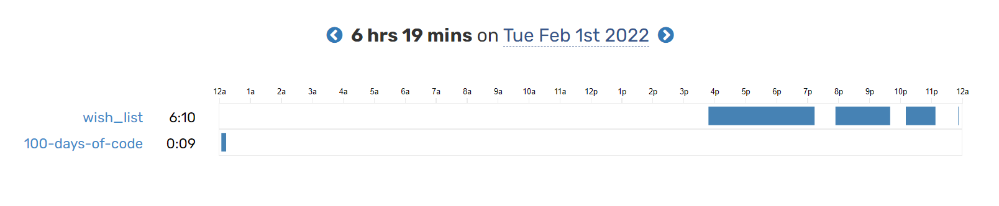

### R1D9
I would lie to myself if I call today's experience exciting. No, it wasn't. I think the main reason my *'outside-of-a-course'* experience. 
I'd describe today as boring, honestly. However, I completed 3 modules of the course:

1. File IO
2. Regular expressions (btw, I found them really cool -- can and will implement in my future Python projects)
3. Testing In Python (ooh, it was *waay* too boring, I dunno why). I can understand why it's important, but now I don't see it usefulness to me.

Despite my entire boringngess, I am looking forward projects suggested in a course. I think it'll be ***very and very useful and cool***.

Time track: 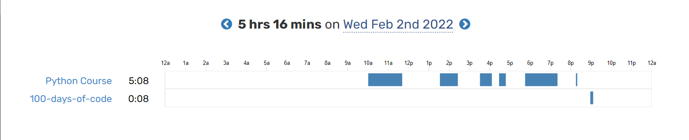

### R1D10
Well, today's amount of coding wasn't that big... However! I ***actually*** liked studying the course today. Learned about the importance of big projects, about stuff I should consider when creating a resume & applying to a job. 

Apart from it, I did a bit of scripting (to be more precise, **image processing**). And I liked it! I solved an exercise *by myself*, but later did some changes so code would look nicer and cleaner. Looking forward to tomorrow!

Time track: 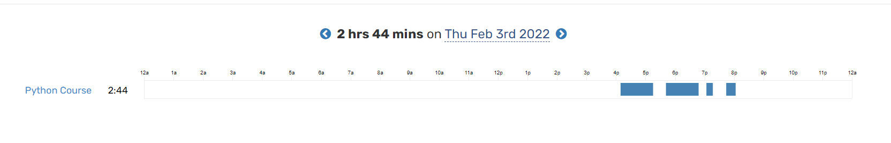

### R1D11
I have mixed feelings about today... On one hand, I didn't do very good on PDF section -- *didn't* like a library (`PyPDF2`) at all. ***But*** It's worth to mention, that I was *surprised* how we can merge PDFs so easily and add watermarks. I guess if I will be working in the future with PDFs, I will more likely either to choose other lib or get over myself!

On the other hand, I did pretty good with email section, even wrote very short program, implementing file I/O and `sys.argv` module. 

Also, school took a lot of my time today :disappointed:. Except of that, it was pretty good day!

Time track: 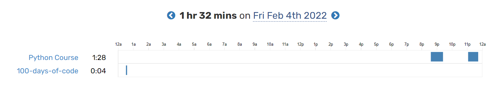
            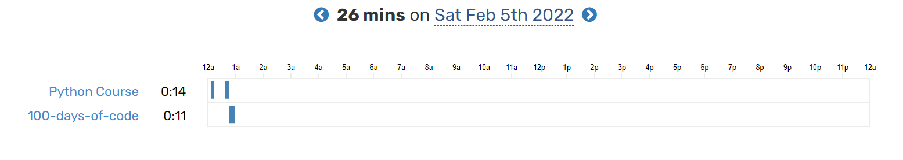

### R1D12
Although I didn't spend too much time on programming today, I feel great because I did a very cool exercise on building a script that securely searches if a password was ever leaked.
It uses an API of `https://haveibeenpwned.com/API/v2` in the way when your password never get sent to this site! If your local machine is secure, then any password you send will be protected!

Tomorrow I'll create a Twitter BOT and will learn how to send SMS using Python. On weekdays I'll try my best to learn Scraping Data & Web Development using Python. I am *familiar* with Scraping data, but Web Development is a totally new thing and I'm ***super excited*** to create my own portfolio!!!

Time track: 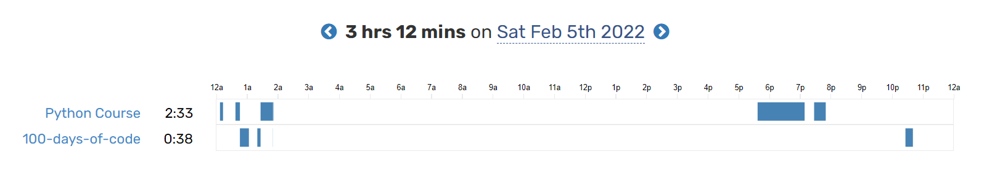

### R1D13
I really wanted to create a Twitter bot today... However, due to technical issues, it never happened.
Anyways, I refershed my knowledge about Twilio lib (I think I can use it in *future* projects).

Despite of headaches and no Twitter bot (*hopefully*, I'll be able to create it tomorrow), I am curretnly at "Scraping Data" section, which is pretty useful and interesting.

Tomorrow is school, so I will probably spend less time on coding :cry:

Time track: 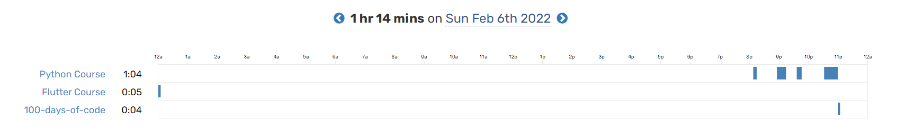

### R1D14
Began coding at evening, as usual these days. Don't know why, but in last couple of days I was undermotivated.

For example, today I completed `Web Scraping` section but wasn't exited almost at all. However, I *improved a project and added some features*. Also, tried to create a project related to this field, but it was unsuccessful...

**BUT**: 
Since I was really exited of creating my own website, I am now very interested in doing it and don't feel undermotivated. 
I am *really, really* want to do it!
And some good news are that I *almost* finished a course! 

Time track: 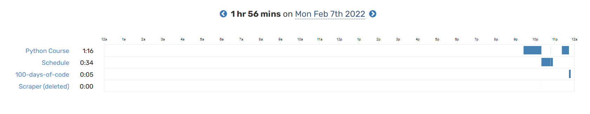

### R1D15
**IT IS SO EXCITING!!!**
I feel *so* motivated about creatign my own site with portfolio! It's not just a cool thing, it is also a very applicable one!
You wouldn't believe me but I was just sitting in front of my computer widely smiling because of happiness.

I realize that I've gone through a bunch of problems, difficulties; sometimes I felt not interested in a particular topic but my **persistence** is a main thing that took me through this...

Well, the course hasn't ended. I still have to do learn some cool things, such as `Automation Testing` & `ML + Data Science` (I hope I'll get good explanations from a teacher!)

Time track: 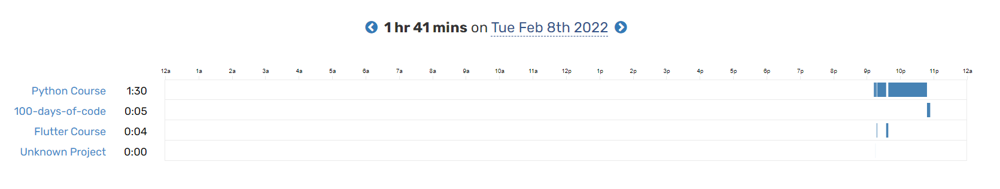

### R1D16
Started creating my portfolio website, which is by now is far from perfect, but after some time it'll be just **fine**!

I am pretty excited about this section and tomorrow will try my best to finish it!

Time track: 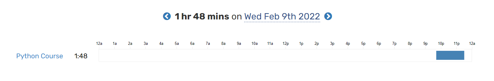

### R1D17
Continued working on my portfolio website. 
Created a simple database and learned about redirection and request methods.

Hopefully, tomorrow I'll finish this section and will start an `Automation_Testing` section!

P.S You may have noticed that total time spent on coding decreased... That's because I'm trying to organize my life in different areas, without concentrating exclusively on coding!

Time track: 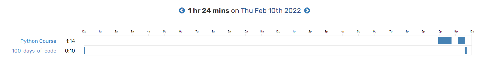