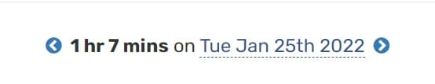

# #100DaysOfCode Log - Round 1 - [unm4sk]

The log of my #100DaysOfCode challenge. Started on [January 25, Tuesday, 2022].

## Log

### R1D1 
Learned a lot new about decorators. Still pretty confusing, but I am getting better at understanding how this concept works. 

Time track: 

### R1D2
Finished learning decorators. Got a bit closer to fully understanding a concept!😎 The power of this function is incredible! Did an excercise to implement what I've learned so far about decorators.
Finished Error Handling part of a course. Was pretty easy because I had implemented it before. However, some things I did *not* know, so it was pretty useful overall. [files to be uploaded]

Time track: 

### R1D3
Didn't pay too much attention for course and decided to spend it implementing gained knowledge about pure functions. I bumped into some problems, esp. with dictionaries and getting values (was using API).
Nevertheless, built a working but not beauty and fully-fledged script. Planning to make it look beautiful and informative!
It is in early development, so I am not sharring a link to my project. If tomorrow won't be so hard day I will upload it on GitHub.
Overall, I am *more* than just satisfied!

Time track: 

### R1D3
Oooh. With no doubt it was the most time I have coded in a day. My thoughts? Don't feel exhausted, not at all! Finished my [defme](https://github.com/unm4sk/defme) project. I have not only implemented libraries I wanted to, but also made my code more logical & clear. Also, I did an *Excel* version of my script. It is way better in terms of perfomance. 
I am very proud of myself, to be honest :) 
I think tomorrow I will focus on a course becaue of opportunities it can provide to me.

Time track: 
